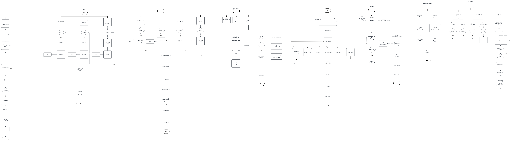
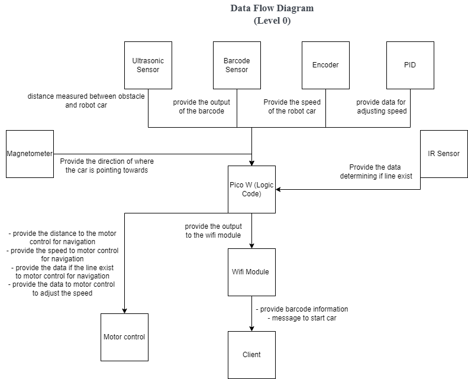

# Group Project for Team 42

## Project Members:
- Jovan Lee Hong Xi (2200913)
- Loo Zong Poh (2203525)
- Ser Quao Zao (2201364)
- Ryan Ong Zhi Yong (2201186)

## Introduction 
Welcome to Team 42's Github Repository for the Robot Car Project in INF2004 Embedded Systems Programming. The team consists of the four of us as mentioned above, this README.md will briefly explain the project and its features. The Robot Car utilises a Raspberry Pico W, a L298N Motor Driver Module, 2 X Motor, a GY-511 Magnetometer, 2 X IR Speed Sensing Module, 3 X IR Line Tracking Module, a HCSR04 Ultrasonic Sensor Module. The GP Pin Out List is also provided for your ease, as well as a block diagram, flowchart and a data flow diagram.

## GP Pin Out List
1. Motor Left PWM - GP15
2. Motor Left Pin 1 and 2 - GP14, GP13
3. Motor Right PWM - GP10
4. Motor Right Pin 1 and 2 - GP11, GP12
5. Encoder Left - GP2
6. Encoder Right - GP3
7. IR Sensor (Left) - GP20
8. IR Sensor (Right) - GP21
9. Barcode Sensor - GP22
10. Ultrasonic Sensor - GP18 (Trigger Pin), GP 19 (Echo Pin)
11. Magnometer - GP4, GP5

## Block Diagram:

## Flowchart:

## Data Flow Diagram:

## Thing to Do:
- [x] Create a repo
- [x] Create Driver Files
- [x] Create Partial Integration Files in ***Implementation*** Directory
- [ ] Create Navigation and Mapping

## How to Clone Repo:
Setting up the environment:
1. Clone the repo and save it in a desired location on your local machine
2. Open the Pico - Visual Studio Code 
3. Open the folder where you clone the repo

## Problem You Might Encounter:
1. If you encounter an error when you try to build the project, try to delete the build folder and try to build again

## References:

