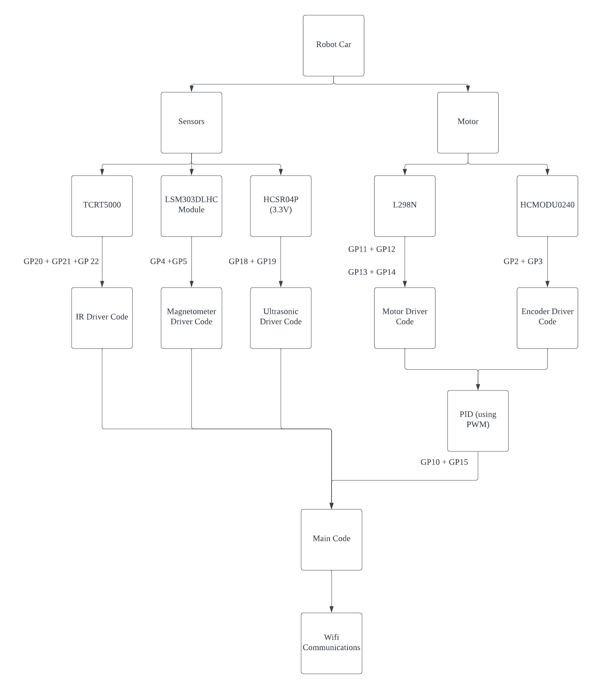
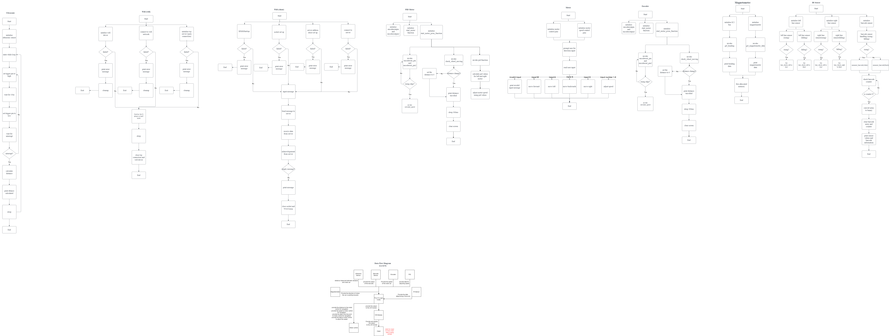

# Group Project for Team 42

## Project Members:
- Jovan Lee Hong Xi (2200913)
- Loo Zong Poh (2203525)
- Ser Quao Zao (2201364)
- Ryan Ong Zhi Yong (2201186)

## GP Pin Out List
1. Motor Left PWM - GP15
2. Motor Left Pin 1 and 2 - GP14, GP13
3. Motor Right PWM - GP10
4. Motor Right Pin 1 and 2 - GP11, GP12
5. Encoder Left - GP2
6. Encoder Right - GP3
7. IR Sensor (Left) - GP20
8. IR Sensor (Right) - GP21
9. Barcode Sensor - GP22
10. Ultrasonic Sensor - GP18 (Trigger Pin), GP 19 (Echo Pin)
11. Magnometer - GP4, GP5

## Thing to do:
- [x] Create a repo
- [x] Create Driver Files
- [x] Create Partial Integration Files in **Implementation Branch**
- [ ] Create Navigation and Mapping

## Block Diagram:

## Flowchart:

## How to Clone Repo:
Setting up the environment:
1. Open a new window in VS Code
2. Clone the repo and save it in a desired location on your local machine
3. After you clone the repo, Close the window
4. Open the Pico - Visual Studio Code 
5. Open the folder where you clone the repo

## Problem You Might Encounter:
1. If you encounter an error when you try to build the project, try to delete the build folder and try to build again

## Pushing Your Changes to the Repo:
1. Do not push your build folder | It will cause an error to other users

